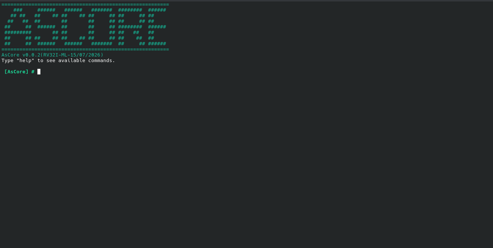

# AsCore 🚀

A minimalist, hobbyist microkernel built from the ground up for the RISC-V architecture.

---

## 📸 Preview



---

## ✨ Features

* **Architecture:** 32-bit RISC-V (`RV32I`)
* **Environment:** 100% Bare-metal development (No standard library, no host OS dependencies)
* **Modular Codebase:** Clean separation between kernel core, task management, IPC, hardware drivers, interrupts, and shell.
* **Hardware Support:** Custom UART driver for serial communication and PLIC-based keyboard interrupts.
* **Interactive Shell:** ANSI-colored, responsive command-line interface directly running on hardware.
* **Task Management:** Fixed-size task table with per-task register context, ready for future context switching.
* **IPC (In Progress):** Syscall-based inter-process messaging via `ecall`, with sender identity resolved from the active task.

---

## 🛠️ Project Structure

* `boot.S` - Assembly entry point and bootstrap loader.
* `trap.S` / `trap.c` - Low-level interrupt and exception handlers.
* `kernel.c` - Core initialization routines and hardware provisioning.
* `shell.c` / `shell.h` - Interactive user interface and command parsers.
* `uart.c` / `uart.h` - Serial communication drivers.
* `task.c` / `task.h` - Task structure, task table, and current-task tracking.
* `ipc.c` / `ipc.h` - Syscall-driven IPC handler and message routing.

## 🚧 Status

- [x] Boot & trap handling
- [x] UART driver + interactive shell
- [x] Task structure + current_task tracking
- [ ] target_pid validation
- [ ] IPC mailbox
- [ ] Scheduler
- [ ] Blocking recv
- [ ] Permission table

---

## 🚀 How to Run

### Prerequisites
You need the RISC-V toolchain (`riscv64-elf-gcc`, `riscv64-elf-ld`) and `qemu-system-riscv32` installed on your system.

### Build and Emulate
Simply run the compilation script to build the microkernel and launch it inside QEMU:

```bash
chmod +x build.sh
./build.sh
```


## ⚖️ License

This project is licensed under the GNU General Public License v3.0. See the `LICENSE` file for details.
